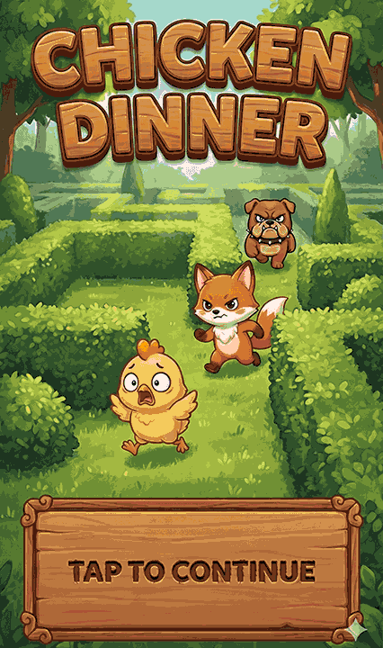

# Chicken Dinner

A fast-paced arcade game where you play as a hungry fox trying to catch chicks while avoiding the guard dog!

Play it [here](https://mesolimbo.github.io/chicken-dinner/) or on [itch.io](http://tinymicrobe.itch.io/chicken-dinner).

## Gameplay

Navigate through a maze of bushes, hunting down chicks before the dog catches you. Each level gets progressively harder as the dog becomes faster and more relentless.



### Controls

**Desktop:**
- **Arrow Keys** or **Click/Drag** to move the fox
- **Spacebar**

**Mobile:**
- **Tap/Drag** to move the fox

### Objective

- Catch all the chicks in each level to advance
- Avoid the dog at all costs – one bite and it's game over!
- Try to beat your high score (saved automatically)

## Running the Game

### Prerequisites

- [Bun](https://bun.sh/) runtime

### Development

```bash
# Install dependencies
bun install
# or make install

# Start the development server
bun run dev
# or make serve
```

The game will be available at `http://localhost:3000`

## Tech Stack

- **TypeScript** - Type-safe game logic
- **HTML5 Canvas** - 2D rendering with y-sorted sprite depth
- **Bun** - Fast JavaScript runtime and bundler

## Features

- Smooth touch and mouse controls optimized for mobile
- Procedurally generated maze layouts with intersecting walls
- Y-sorted sprite rendering for proper depth perception
- Progressive difficulty scaling
- Persistent high score tracking

## License

MIT
